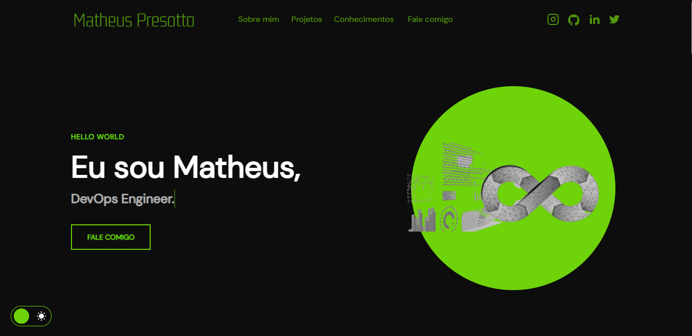

<h1 align="center">Portfólio - Giulia Cardoso 💻</h1>

<h4 align="center"><a href="https://https://giuliacrd.vercel.app">Confira o projeto aqui</a></h4>

---

## 💻 Sobre

Projeto feito no intuito de me apresentar, como UX Designer.

## 🤯 O site é composto por:

- **Home:** Minha apresentação;
- **Sobre mim:** Falo um pouco sobre minha experiencia atual na área;
- **Projetos:** Alguns projetos recentes qual estou participando;
- **Conhecimentos:** As tecnologias quais possuo conhecimento;
- **Fale comigo:** Área com meios para me contatar;
- **Redes:** Minhas redes sociais disponíveis no menu de navegação e no rodapé do site.

## 🧠 Tecnologias utilizadas:

O site **ainda está em desenvolvimento**, pois estou em constante aprendizado. Mas até aqui utilizei as tecnologias:

    
    
    

## 📚 Alguns conceitos aplicados

Neste projeto apliquei os seguintes pontos:
+ Semântica HTML;
+ Pontos de acessibilidade;
+ Responsividade;
+ Mobile first;
+ Utilização da lib JS <a href="https://scrollrevealjs.org">Scroll Reveal</a>.

---

<table>
  <tr>
    <td>
      
    </td>
    <td>
      Feito por <a href="https://github.com/giuliacrd</a>
    </td>
  </tr>
</table>

